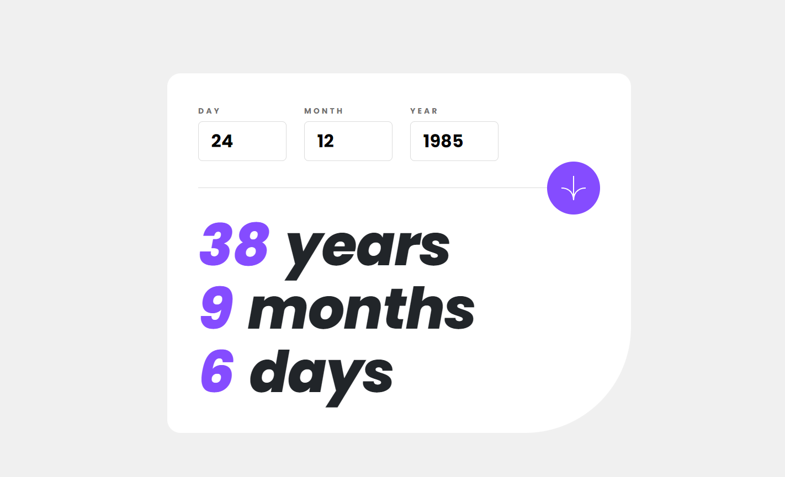

# Frontend Mentor - Age calculator app solution

This is a solution to the [Age calculator app challenge on Frontend Mentor](https://www.frontendmentor.io/challenges/age-calculator-app-dF9DFFpj-Q). Frontend Mentor challenges help you improve your coding skills by building realistic projects. 

## Table of contents

- [Overview](#overview)
  - [The challenge](#the-challenge)
  - [Screenshot](#screenshot)
  - [Links](#links)
- [My process](#my-process)
  - [Built with](#built-with)
  - [What I learned](#what-i-learned)
  - [Continued development](#continued-development)
  - [Useful resources](#useful-resources)
- [Author](#author)
- [Acknowledgments](#acknowledgments)

**Note: Delete this note and update the table of contents based on what sections you keep.**

## Overview

### The challenge

Users should be able to:

- View an age in years, months, and days after submitting a valid date through the form
- Receive validation errors if:
  - Any field is empty when the form is submitted
  - The day number is not between 1-31
  - The month number is not between 1-12
  - The year is in the future
  - The date is invalid e.g. 31/04/1991 (there are 30 days in April)
- View the optimal layout for the interface depending on their device's screen size
- See hover and focus states for all interactive elements on the page
- **Bonus**: See the age numbers animate to their final number when the form is submitted

### Screenshot



### Links

- Solution URL: [GitHub](https://github.com/Simplify4Me2/age-calculator-app)
- Live Site URL: [GitHub Pages](https://simplify4me2.github.io/age-calculator-app)

## My process

### Built with

- Semantic HTML5 markup
- CSS custom properties
- Flexbox
- [Blazor WASM](https://learn.microsoft.com/en-us/aspnet/core/blazor/hosting-models?view=aspnetcore-8.0#blazor-webassembly)
- [GitHub CoPilot](https://visualstudio.microsoft.com/github-copilot/)

### What I learned

Since it was my first time using Blazor, I definitely learned a lot about its built-in form handling and overall structure. Working in Visual Studio 2022 Community Edition was also a bit of an adjustment compared to VS Code, which I’m more familiar with. I discovered that Blazor handles a lot behind the scenes, and using Chrome DevTools really helped me dig deeper and understand what was going on.


Use this section to recap over some of your major learnings while working through this project. Writing these out and providing code samples of areas you want to highlight is a great way to reinforce your own knowledge.

Using a Timer to animate the calculated age:

```c#
protected override void OnInitialized()
{
    timer = new Timer(UpdateCounter, null, 0, 50);
}
```
Declaring local fonts was a hassle. The font-weight and font-style matter by the way!
```css
@font-face {
    font-family: 'Poppins';
    src: url('../fonts/Poppins-Regular.ttf') format('truetype');
    font-weight: normal;
    font-style: normal;
}

@font-face {
    font-family: 'Poppins';
    src: url('../fonts/Poppins-Bold.ttf') format('truetype');
    font-weight: bold;
    font-style: normal;
}

@font-face {
    font-family: 'Poppins';
    src: url('../fonts/Poppins-Italic.ttf') format('truetype');
    font-weight: normal;
    font-style: italic;
}

@font-face {
    font-family: 'Poppins';
    src: url('../fonts/Poppins-BoldItalic.ttf') format('truetype');
    font-weight: bold;
    font-style: italic;
}

@font-face {
    font-family: 'Poppins Extra';
    src: url('../fonts/Poppins-ExtraBold.ttf') format('truetype');
    font-weight: bold;
    font-style: normal;
}

@font-face {
    font-family: 'Poppins Extra';
    src: url('../fonts/Poppins-ExtraBoldItalic.ttf') format('truetype');
    font-weight: bold;
    font-style: italic;
}
```
using C# for validation logic is easier because it's a fully typed language
```C#
public class ValidDateAttribute : ValidationAttribute
{
    protected override ValidationResult? IsValid(object? value, ValidationContext validationContext)
    {
        if (value is null)
            return new ValidationResult("This field is required");

        var day = (int) value;

        if (day < 1 || day > 31)
            return new ValidationResult("Must be a valid day");

        Input model = (Input)validationContext.ObjectInstance;

        if (model is null || model.Month is null || model.Year is null)
            return ValidationResult.Success;
        var isValidDate = DateTime.TryParse($"{model.Month}/{value}/{model.Year}", CultureInfo.InvariantCulture, out _);

        if (!isValidDate)
            return new ValidationResult("Must be a valid date");
        
        return ValidationResult.Success;
    }
}
```

### Continued development

As a seasoned C# backend developer, I’d like to say I’ll dive deeper into frontend development with Blazor, but honestly, it felt more alienating than anything. CSS mysteriously breaks if it’s declared in the wrong file, and the amount of tweaking I had to do for form validation made me wonder if plain old JavaScript wouldn’t have been less of a headache. I think I’ll give it a break for now—maybe after JS drives me up the wall again, I’ll take another shot at this "sunny" side of development.

### Useful resources

- [Microsoft Learn - Blazor WebAssembly](https://learn.microsoft.com/en-us/aspnet/core/blazor/hosting-models?view=aspnetcore-8.0#blazor-webassembly) - I kept the official docs as my main source of information, although ChatGPT helped me a lot through the details and hard bits.
- [Swimburger Blog](https://swimburger.net/blog/dotnet/how-to-deploy-aspnet-blazor-webassembly-to-github-pages) - How to deploy a Blazor standalone app to Github Pages.
- [CSS Tricks](https://css-tricks.com/animating-number-counters/) - Animating number counters

## Author

- Website - [Simon Vereecke](https://simplify4me2.github.io/)
- Frontend Mentor - [@Simplify4Me2](https://www.frontendmentor.io/profile/Simplify4Me2)
- Twitter / X - [@simon_vereecke](https://x.com/simon_vereecke)
- GitHub - [@Simplify4Me2](https://github.com/Simplify4Me2)

## Acknowledgments

Big shoutout to the C# purists who can't stand JavaScript for talking me into ditching every other JS framework out there. They swore up and down it would be easier. They promised me typing. What they conveniently left out was how Blazor Forms is such a brutal developer experience that it makes you seriously question why you ever strayed from good old plain JavaScript in the first place.
